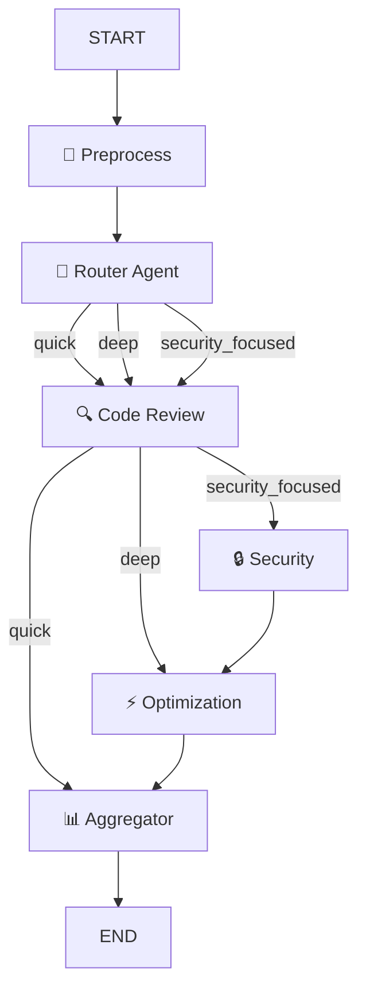

# 🧠 Agentic AI Code Analyzer

A production-grade, **multi-agent AI system** built with **LangGraph** that performs intelligent code analysis using specialized agents for code review, security scanning, and performance optimization.


---

## 🚀 Features

- **Multi-Agent Architecture** — Specialized agents for code review, security, and optimization
- **Intelligent Routing** — Automatically selects analysis depth (Quick / Deep / Security-Focused)
- **4 Functional Tools** — Language detection, complexity scoring, security scanning, pattern checking
- **Conditional Graph Flow** — LangGraph with `add_conditional_edges` for dynamic routing
- **Rich State Management** — TypedDict state with metadata, scores, and per-agent outputs
- **Premium Streamlit UI** — Tabbed interface with metrics dashboard, export, and session history
- **Multi-Model Support** — Switch between LLaMA 3.1 8B, LLaMA 3.3 70B, Gemma 2, and Mixtral
- **Exportable Reports** — Download analysis reports as markdown

---

## 🏗️ Architecture



### Agent Roles

| Agent | Role |
|---|---|
| **Preprocessor** | Runs tools: language detection, complexity scoring, security scanning, pattern checking |
| **Router** | Analyzes tool results and decides analysis path (quick / deep / security_focused) |
| **Code Review** | Deep code review: bugs, logic errors, readability, best practices, refactored code |
| **Security** | Vulnerability analysis: injection, secrets, OWASP Top 10, secure code rewrites |
| **Optimization** | Performance: time/space complexity, data structures, caching, async patterns |
| **Aggregator** | Combines all specialist reports into a scored, prioritized final report |

---

## 📦 Tech Stack

| Technology | Purpose |
|---|---|
| [LangGraph](https://github.com/langchain-ai/langgraph) | Multi-agent workflow orchestration with conditional routing |
| [LangChain](https://github.com/langchain-ai/langchain) | LLM framework, tools, and prompt management |
| [Groq](https://groq.com/) | Ultra-fast LLM inference (LLaMA 3.1, 3.3, Gemma 2, Mixtral) |
| [Streamlit](https://streamlit.io/) | Interactive web application with premium UI |
| [python-dotenv](https://github.com/theskumar/python-dotenv) | Environment variable management |

---

## 📁 Project Structure

```
Agentic-Ai-Code_Analyzer-/
├── app.py               # Streamlit entry point — premium UI with tabs & metrics
├── config.py            # Configuration, LLM factory, logging, multi-model support
├── state.py             # Rich state schema (TypedDict) for the LangGraph workflow
├── tools.py             # 4 functional tools: language, complexity, security, patterns
├── agents.py            # 5 specialized agent chains with expert system prompts
├── graph.py             # LangGraph workflow builder with conditional routing
├── requirements.txt     # Pinned dependencies
├── .env                 # API keys (not tracked)
├── .gitignore           # Git ignore rules
└── README.md            # This file
```

---

## ⚙️ Setup & Installation

### 1. Clone the repository

```bash
git clone https://github.com/ManojPentapati/Agentic-Ai-Code_Analyzer-.git
cd Agentic-Ai-Code_Analyzer-
```

### 2. Create a virtual environment

```bash
python -m venv .venv
```

**Activate it:**

- **Windows:** `.venv\Scripts\activate`
- **macOS / Linux:** `source .venv/bin/activate`

### 3. Install dependencies

```bash
pip install -r requirements.txt
```

### 4. Set up environment variables

Create a `.env` file in the project root:

```env
GROQ_API_KEY=your_groq_api_key_here
```

> 💡 Get your free API key from [Groq Console](https://console.groq.com/).

### 5. Run the application

```bash
streamlit run app.py
```

The app will open in your browser at `http://localhost:8501`.

---

## 🎯 How It Works

1. **Paste** your code into the editor
2. **Configure** model, temperature, and max tokens in the sidebar
3. **Click** "🚀 Analyze Code"
4. The system automatically:
   - Detects the programming language
   - Calculates code complexity (0-100)
   - Scans for security vulnerabilities
   - Routes to the appropriate analysis depth
   - Runs specialized agents in sequence
   - Aggregates results into a scored final report
5. **Review** results across tabs: Full Report, Code Review, Security, Optimization
6. **Download** the report as a markdown file

---

## 🔀 Routing Logic

| Condition | Route | Agents Executed |
|---|---|---|
| Security scan finds HIGH/CRITICAL issues | `security_focused` | Code Review → Security → Optimization → Aggregator |
| Complexity ≥ 40 or 3+ functions | `deep` | Code Review → Optimization → Aggregator |
| Simple code | `quick` | Code Review → Aggregator |

---

## 🤝 Contributing

1. Fork the repository
2. Create a feature branch (`git checkout -b feature/new-feature`)
3. Commit your changes (`git commit -m 'Add new feature'`)
4. Push to the branch (`git push origin feature/new-feature`)
5. Open a Pull Request

---

## 📄 License

This project is open source and available under the [MIT License](LICENSE).

---

## 👤 Author

**Manoj Pentapati**

- GitHub: [@ManojPentapati](https://github.com/ManojPentapati)

---

> ⭐ If you found this project helpful, give it a star on GitHub!
